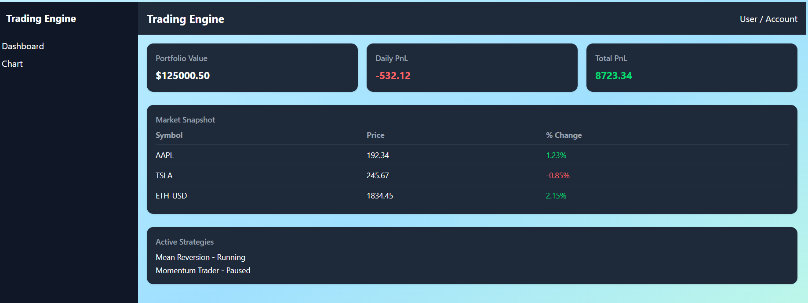
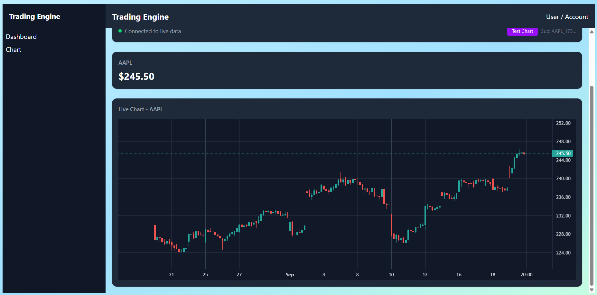

# Day N' Night #

### Trading Engine in Rust ###

A Rust-powered quantitative finance playground with Python interop for ML and visualization.
Built to showcase systems programming, quant finance theory, and machine learning skills in a single project.

## How to Run ##

### Frontend ###
Go to `crates/frontend` and run `trunk serve --open`

### Backend ###
Go to `crates/backend` and run `cargo run`

## Dashboard ##

## Price Chart ##
